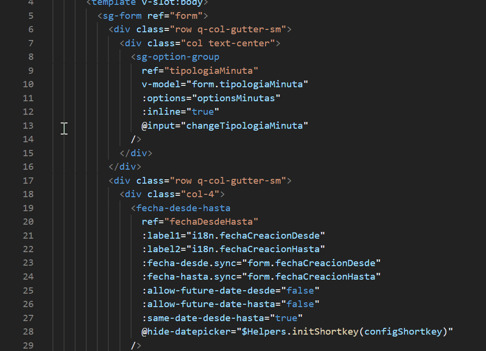
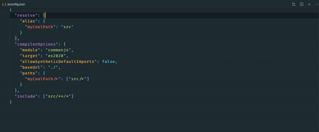

  <h1 align="center">Vue Discovery MTM🔭</h1>

  
  
  

This extension discovers Vue components in your workspace and provides IntelliSense for them. Just starting typing your component name and press enter to automatically import, register and expand any required props.

## ✨ Features

##### Provide IntelliSense for components in template section

##### Automatically import, register and expand required props

##### Provide IntelliSense for props on components

##### Show available props on hover

##### Provide IntelliSense for events

##### Uses your defined paths in `jsconfig.json`

##### Import with `cmd + i`, this is useful for importing pasted components

## 🔧 Extension Settings

This extension can be customized with the following settings:

-   `VueDiscoveryMTM.rootDirectory`: this tells where to look for vue components. It admits several paths with a ';' separator (default: `\src`)
-   `VueDiscoveryMTM.registeredDirectory`: this tells where to look for vue components that are previosly registered in Vue an do not need to be imported. It admits several paths with a ';' separator (default: ``)
-   `VueDiscoveryMTM.componentCase`: The casing for the component, available options are `kebab` for kebab-case and `pascal` for PascalCase (default: `pascal`)
-   `VueDiscoveryMTM.addTrailingComma`: Add a trailing comma to the registered component (default: `true`)
-   `VueDiscoveryMTM.propCase`: The casing for the props, available options are `kebab` for kebab-case and `camel` for camelCase (default: `kebab`)

## 🔖 Release Notes

### 0.1.0

Initial version
