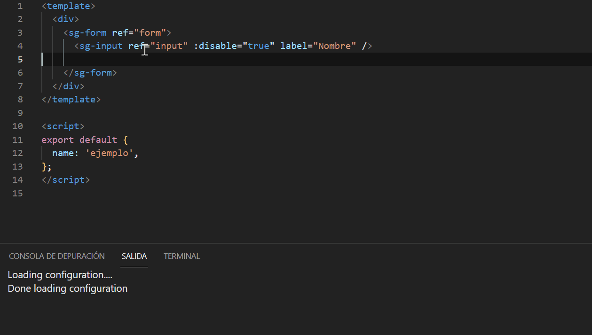

  <h1 align="center">Vue Discovery MTM🔭</h1>

  
  
  

This extension discovers Vue components in your workspace and provides IntelliSense for them. Just starting typing your component name and press enter to automatically import, register and expand any required props.

## ✨ Features

##### Provide IntelliSense for components in template section

##### Automatically import, register and expand required props

##### Provide IntelliSense for props on components

##### Show available props on hover

##### Provide IntelliSense for events

## 🔧 Extension Settings

This extension can be customized with the following settings:

-   `VueDiscoveryMTM.rootDirectory`: this tells where to look for vue components. It admits several paths with a ';' separator (default: `\src`).
-   `VueDiscoveryMTM.registeredDirectory`: this tells where to look for vue components that are previosly registered in Vue an do not need to be imported. It admits several paths with a ';' separator (default: ``).
-   `VueDiscoveryMTM.componentCase`: The casing for the component, available options are `kebab` for kebab-case and `pascal` for PascalCase (default: `pascal`).
-   `VueDiscoveryMTM.addTrailingComma`: Add a trailing comma to the registered component (default: `true`).
-   `VueDiscoveryMTM.propCase`: The casing for the props, available options are `kebab` for kebab-case and `camel` for camelCase (default: `kebab`).
-   `VueDiscoveryMTM.propIconType`: The type of icon shown for properties of the component (default: `Snippet`, cause help to bring them at first positions).
-   `VueDiscoveryMTM.includeRefAtribute`: Boolean to choose if  a 'ref' atribute in the component is generated when creating a tag component ( default: `true`).
-   `VueDiscoveryMTM.hoverComponentInfoType`: Define what info must be shown in the hover over a tag component. By now only props or none values are possible ( default: `props`).
-   `VueDiscoveryMTM.useComponentShowcase`: Define if we will show help info for a component when hover is  over that component and we push over `Ctrl` button. This help comes from the showCase application (default: `true`).
-   `VueDiscoveryMTM.componentShowcaseUrl`: URL for Components Showcase Application to show examples of how to use them. Only used when property useComponentShowcase is set to true. (default: http://10.12.19.106:32006).

## 🔖 Release Notes

### 0.1.0

Initial version
